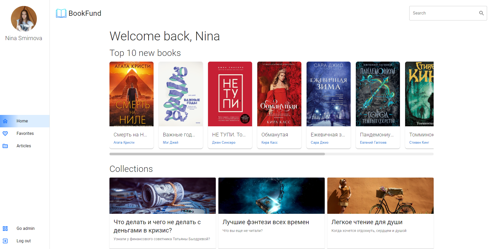
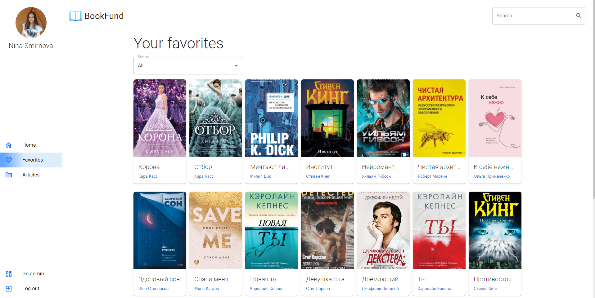
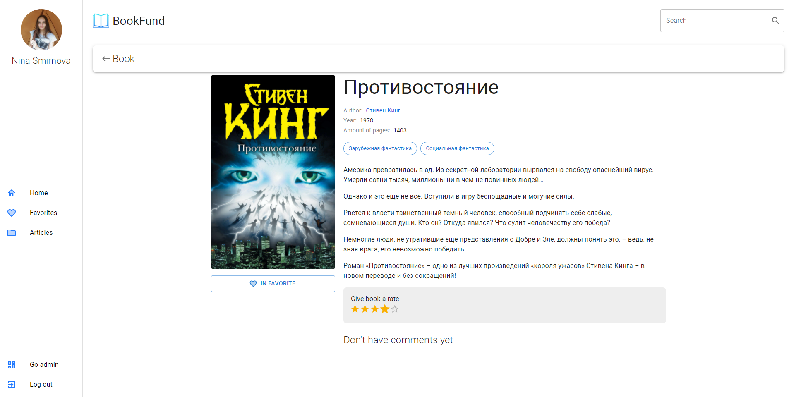
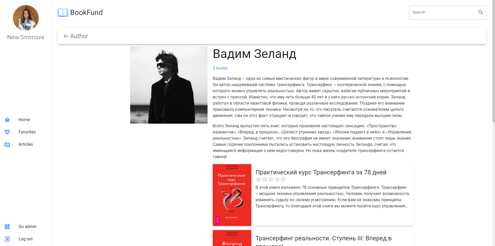
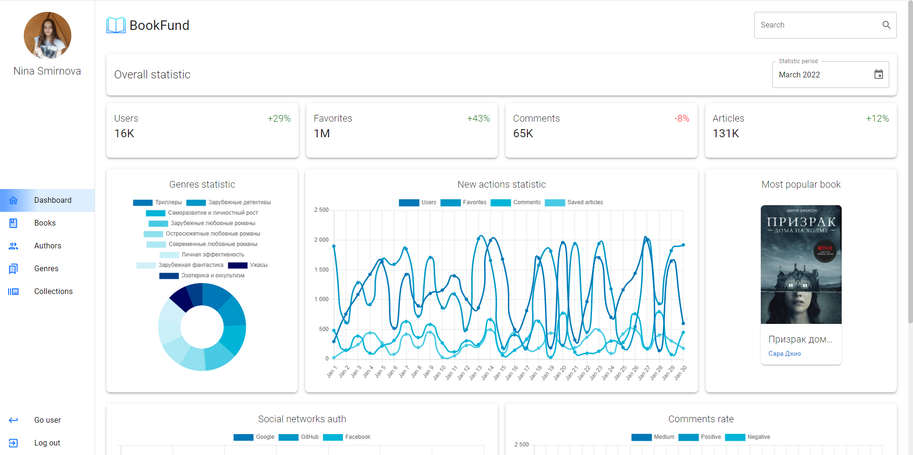

# Bookfund-v.2
A small application created using React and Node. Handles tables from the database by adding, editing, and deleting records.

<p align="center">





</p>

### Docker

To run docker image, go to **docker** folder and run next command (your cmd should be in the same folder as dockerfile):
```
  docker build -t bookfund-postgres .
```

And then to create docker container, run second command:
```
  docker run --name bookfund-postgres -p 5432:5432 -d bookfund-postgres
```

### Database

To simply run migrations use command in deployed environment:
```
  npm run migrations:run
```
To add seed data  in deployed environment:
```
  npm run seed:run
```

To run migrations use command locally:
```
  nx run webapi:migrations
```
To add seed data locally:
```
  nx run webapi:seed
```

### Start application

If you want to open project locally, not forget include dev mode environment variable in migrations and seeds commands. 
For example: 
```
nx run PROJECT_NANE:dev
```

### Build

To build project run the following commands
```
nx build webapi
nx build webapp --stats-json
```
To check webapp bundle size after build run:
```
npm run analyze:webapp
```

Note: webapi requires node v.18.0.0 for work
